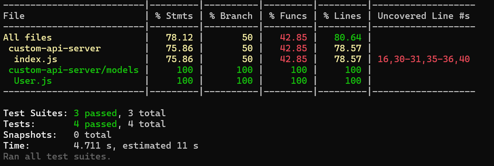

# Custom API Server – Keploy API Fellowship

A simple Express.js-based API server built by **Shruti Sinha** as part of the **Keploy API Fellowship**. It enables clients to perform CRUD (Create, Read, Update, Delete) operations on user data stored in **MongoDB Atlas**.


## About This Project

- Built using **Node.js** and **Express.js**
- Connected to **MongoDB Atlas** using **Mongoose**
- Provides RESTful API endpoints for managing user records
- Fully tested using **Jest** for unit, integration, and API-level validation
- Achieved over **78% code coverage**
- Runs locally for development and testing


## Tech Stack

- **Backend:** Node.js, Express.js
- **Database:** MongoDB Atlas (cloud-based NoSQL)
- **ODM:** Mongoose
- **Testing:** Jest, Supertest
- **Environment Management:** dotenv


## API Endpoints

### POST `/users`
Creates a new user.

**Request Body:**
```json
{
  "name": "Shruti",
  "email": "22051282@kiit.ac.in",
  "age": 20
}
```

**Response:**
```json
{
  "_id": "65f5c983dbcfd7fa89a82eca",
  "name": "Shruti",
  "email": "22051282@kiit.ac.in",
  "age": 20,
  "__v": 0
}
```

### GET `/users`
Retrieves all users stored in the database.

**Response:**
```json
[
  {
    "_id": "65f5c983dbcfd7fa89a82eca",
    "name": "Shruti",
    "email": "22051282@kiit.ac.in",
    "age": 20,
    "__v": 0
  }
]
```

### PUT `/users/:id`
Updates a user's details by ID.

**Request Body:**
```json
{
  "name": "Shruti Sinha",
  "email": "sinha.shruti0211@gmail.com",
  "age": 20
}
```

**Response:**
```json
{
  "_id": "65f5c983dbcfd7fa89a82eca",
  "name": "Shruti Sinha",
  "email": "sinha.shruti0211@gmail.com",
  "age": 20,
  "__v": 0
}
```

### DELETE `/users/:id`
Deletes a user by their ID.

**Response:**
```json
{
  "message": "User deleted"
}
```

## How to Run Locally

### 1. Clone the Repository
```bash
git clone https://github.com/shrutisinha02/custom-api-server.git
cd custom-api-server
```

### 2. Install Dependencies
```bash
npm install
```

### 3. Set Up Environment Variables
Create a `.env` file in the root folder with:
```
MONGO_URI=mongodb+srv://<username>:<password>@cluster0.mongodb.net/?retryWrites=true&w=majority
MONGO_URI_TEST=mongodb+srv://<username>:<password>@cluster0.mongodb.net/testDB?retryWrites=true&w=majority
```

### 4. Start the Server
```bash
node index.js
```
Server runs at: [http://localhost:5000](http://localhost:5000)

---

## Running Tests
Run all unit, integration, and API tests using:
```bash
npm test
```

### Tools Used:
- **Jest** for test runner and coverage
- **Supertest** for API testing

### Code Coverage Screenshot:


---

## API Testing with Postman

| Method | Endpoint     | Description       |
| ------ | ------------ | ----------------- |
| GET    | `/users`     | Fetch all users   |
| POST   | `/users`     | Create new user   |
| PUT    | `/users/:id` | Update user by ID |
| DELETE | `/users/:id` | Delete user by ID |

---

## Folder Structure
```
custom-api-server/
├── models/              
├── tests/               
│   ├── unit/
│   ├── api/
│   └── integration/
├── .env
├── index.js             
├── package.json
├── assets/
│   └── test_coverage.png
└── README.md
